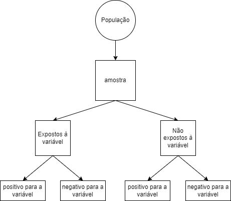

# Tipos de Estudos

## Estudos Observacionais

Os estudos observacionais são conduzidos através da observação de eventos ou fenômenos naturais, sem intervenção direta do pesquisador na atribuição de tratamentos ou exposições. Eles são úteis para explorar associações entre variáveis, identificar padrões e gerar hipóteses. Existem diferentes tipos de estudos observacionais:

### Estudos de Coorte

Os estudos de coorte acompanham grupos de indivíduos ao longo do tempo para identificar possíveis fatores de risco ou causas de doenças. Os participantes são classificados com base em características como exposição a um fator de risco ou presença de uma condição de saúde, e então são acompanhados para determinar se desenvolvem a doença de interesse.

### Estudos de Caso-Controle

Nesses estudos, os participantes são selecionados com base em sua condição (casos) e são comparados com indivíduos semelhantes que não têm a condição (controles). O pesquisador investiga retrospectivamente a exposição a diferentes fatores de risco entre os casos e os controles para identificar associações entre esses fatores e a condição de interesse.

- Retrospectivo: Nesse tipo de estudo, os pesquisadores analisam dados já existentes e retrospectivamente coletados sobre os participantes. Eles selecionam indivíduos que já têm a condição de interesse (casos) e os comparam com um grupo de controle semelhante, mas que não possui a condição. A exposição a diferentes fatores de risco é então investigada retrospectivamente, ou seja, os pesquisadores examinam o histórico dos participantes em relação a esses fatores para identificar associações com a condição em estudo. Estudos de caso-controle são um exemplo comum de estudos retrospectivos.
- Prospectivo: Em contraste, os estudos prospectivos acompanham os participantes ao longo do tempo a partir do momento da seleção para o estudo. Os participantes são escolhidos com base em sua condição de exposição a um fator de interesse (por exemplo, um novo tratamento, estilo de vida ou exposição ambiental) e são acompanhados para determinar se desenvolvem a condição de interesse (casos) ou não (controles). Dados são coletados ao longo do período do estudo para analisar associações entre a exposição inicial e o desenvolvimento da condição de interesse. Estudos de coorte são exemplos comuns de estudos prospectivos.

### Estudos Transversais

Também chamado de secciona ou estudo de prevalência, os estudos transversais coletam dados em um ponto específico no tempo, examinando a relação entre diferentes variáveis em uma população em um determinado momento. Eles são úteis para examinar a prevalência de uma condição de saúde ou comportamento em uma população em um momento específico. O Fator de exposuição e o desfecho são observados simultaneamente.

## Estudos Experimentais

Os estudos experimentais envolvem a manipulação deliberada de uma ou mais variáveis independentes para observar o efeito causado sobre uma ou mais variáveis dependentes. Eles são usados para testar hipóteses causais e estabelecer relações de causa e efeito. Alguns exemplos de estudos experimentais incluem:

### Experimentos de Laboratório Controlados

Nesses experimentos, os pesquisadores manipulam variáveis independentes em um ambiente controlado para examinar os efeitos dessas manipulações sobre as variáveis dependentes. Eles fornecem controle rigoroso sobre as condições experimentais, permitindo estabelecer relações causais mais fortes.

### Experimentos de Campo

Os experimentos de campo são conduzidos em ambientes do mundo real, fora de um laboratório controlado. Eles permitem que os pesquisadores avaliem o impacto de intervenções em situações do dia a dia e são frequentemente usados em áreas como ciências sociais, economia e educação.

### Ensaios Clínicos Randomizados (ECRs)

Nos ECRs, os participantes são randomicamente designados para receber um tratamento experimental ou um placebo (grupo de controle). Isso ajuda a minimizar o viés na atribuição de tratamentos e permite avaliar o efeito do tratamento com mais confiança.

Como exemplo, o CONSORT (Consolidated Standards of Reporting Trials) é um conjunto de diretrizes desenvolvido para melhorar a qualidade e transparência dos relatórios de ensaios clínicos randomizados (ECRs). Ele fornece uma estrutura para garantir que todos os elementos essenciais do estudo sejam relatados de forma clara e completa.

As diretrizes do CONSORT abrangem vários aspectos dos ECRs, incluindo:

- Detalhes sobre o processo de randomização e alocação dos participantes.
- Descrição das intervenções e procedimentos do estudo.
- Métodos estatísticos utilizados na análise dos dados.
- Relato dos resultados primários e secundários do estudo.
- Transparência na divulgação de informações sobre os participantes, intervenções e resultados.

Um exemplo fictício de aplicação do CONSORT em um ensaio clínico randomizado seria:

1. **Título:**
   - "Efeito da terapia cognitivo-comportamental na redução da ansiedade em pacientes com transtorno de ansiedade generalizada: um ensaio clínico randomizado controlado."

2. **Métodos:**
   - Descrição detalhada do processo de randomização dos participantes em grupos de intervenção e controle.
   - Explicação clara das intervenções utilizadas em cada grupo e dos critérios de inclusão e exclusão.

3. **Resultados:**
   - Relato completo dos resultados primários, como mudanças na pontuação da escala de ansiedade, e resultados secundários, como taxa de resposta ao tratamento.
   - Análise estatística detalhada dos dados, incluindo os testes utilizados e os valores de significância.

Ao seguir as diretrizes do CONSORT, os pesquisadores garantem que seu relatório de ensaio clínico seja claro, completo e informativo, facilitando a interpretação e a avaliação da validade e relevância dos resultados do estudo.
