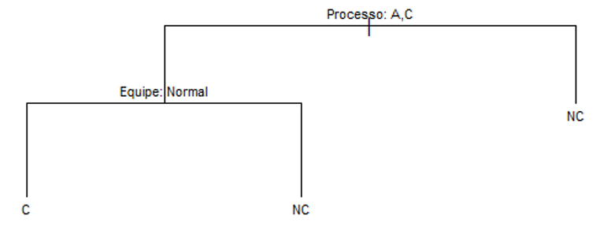

Uma determinada companhia de telefonia móvel vinha sofrendo com o alto número de contratos defeituosos de vendas realizadas nas suas lojas para pessoas físicas. Ela decidiu pedir ajuda a uma Engenheira da qualidade, que - em trabalho conjunto com as equipes operacionais e alguns gestores - testou 3 novos processos de emissão de contratos, denominados de processos A, B e C, em várias das lojas da companhia, para verificar qual deles traria melhor resultado na diminuição do índice de contratos defeituosos. Na linguagem da qualidade, defeito e não conformidade são sinônimos. Além disso, testaram esses processos em dias de movimento alto e baixo, e com equipes de tamanho normal ou reduzido. Para a classificação, os dados foram coletados e tratados por meio de uma árvore de decisão cujo gráfico resultante é mostrado a seguir:

F
Nessa árvore, C = Conforme e NC = Não Conforme. Com esse resultado em mãos, a engenheira da qualidade pôde recomendar qual a melhor solução a adotar para a redução do índice de contratos não conformes.
Tomando esse relato como base, responda às seguintes perguntas:

1) Quais são as variáveis de entrada e qual é a variável resposta? E quais são os seus tipos?
 - Movimento (Alto ou Baixo), sendo uma variável qualitativa ordinal
 - Tamanho da Equipe (Normal ou Reduzido), sendo uma variável qualitativa nominal
 - Processo (A, B ou C), sendo uma variável qualitativa nominal
2) Que variável de entrada a árvore de decisão considerou como a mais importante? E qual a segunda variável mais importante?
Processo é a mais importante, sequido pelo tamanho da equipe
3) Esta árvore, como modelo preditivo, considerou relevante o efeito do movimento alto ou baixo na produção de contratos não conformes?
não, a imagem mostra apenas os nós de processo e tamanho da equipe.
4) De acordo com as predições desta árvore, qual a melhor solução a ser empregada pela companhia de telefonia móvel?
A melhor solução se inicia pelo processo e na sequência o tamanho da equipe. Temos uma equipe de tamanho normal condicionando os processos conformes e respeitando os processos A,C.