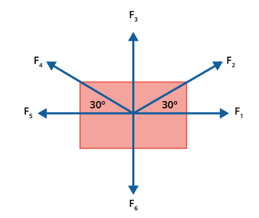

# Regressão Linear (algebra matricial para determinação de coeficiente)

No exemplo implementado em `algebra-matricial.py`, aplicamos um método para calcular os coeficientes de uma regressão linear utilizando álgebra matricial. O processo segue os seguintes passos:

1. Importar as bibliotecas necessárias (numpy para cálculos e sympy para manipulação matricial)
2. Preparar os dados de entrada (X e Y)
3. Construir as matrizes necessárias para o cálculo
4. Calcular os coeficientes usando a fórmula $$\hat{\beta} = (X'X)^{-1}X'Y$$
5. Avaliar o ajuste do modelo através do R²

A implementação completa pode ser encontrada em `algebra-matricial.py`. Aqui está uma visão geral do processo:

### 1. Bibliotecas e Preparação
Utilizamos numpy para operações numéricas e sympy.matrices para cálculos matriciais específicos.

### 2. Construção das Matrizes
- Matriz X: combina uma coluna de 1's (para o intercepto) com os valores independentes
- Matriz Y: valores dependentes em formato de coluna

### 3. Cálculo dos Coeficientes
Aplicamos a fórmula matricial $$\hat{\beta} = (X'X)^{-1}X'Y$$ onde:
- X' é a transposta de X
- (X'X)^-1 é a inversa do produto de X' e X
- O resultado β contém o intercepto (β0) e o coeficiente angular (β1)

### 4. Avaliação do Modelo
Calculamos o R² para medir a qualidade do ajuste:
- R² = 1 - (SS_res / SS_tot)
- SS_res: soma dos quadrados dos resíduos
- SS_tot: soma total dos quadrados

Para exemplos práticos e a implementação detalhada, consulte o arquivo `algebra-matricial.py`. Este código implementa a regressão linear utilizando álgebra matricial em Python, sem depender de pacotes estatísticos específicos. Ele calcula os coeficientes β0 (intercepto) e β1 (coeficiente angular), bem como o coeficiente de determinação R² para avaliar a qualidade do ajuste do modelo.

O conceito de vetores e suas operações aparecem muito na Física, por exemplo,  no cálculo do trabalho realizado por uma força ou também no conceito de força.

Levando em conta o texto acima, vamos considerar um caixa de massa de 50 kg que está sujeito a duas forças, mostrada na figura abaixo. Considerando que o trabalho realizado por uma força é definido por:

W=F.d

Calcule o trabalho total realizado por todas as forças em um deslocamento de 10 m sobre essa caixa. As forças têm módulos de F1=20N, F2´=20N, F3=30N, F4=5N, F5=10N e F6=15N. Escreva cada passo nos seus cálculos.

1. decomposições das forças F2 e F4. Temos:
F2x = 20N * cos30º = 17,32N
F2y = 20N * sen30º = 10N
F4x = 5N * cos30º = 4,33N
F4y = 5N * sen30º = 2,5N

2. somatório das forças
Eixo X = 20N + 17,32N - 4,33N - 10N
Fx = 23N
Eixo Y = 30N + 10N + 2,5N - 15N
Fy = 27,5N

3. resultante:
Fr = √(23N)² + (27,5N)²
Fr = 35,85N

4. angulo
arctg = (27,5/23)
0.8419 rad
0.8419 * 57.29
θ = 48°

5. força
W = 25,85N * 10m cos(48°)
W = 358,5 * 0,6691
W = 239,71 J